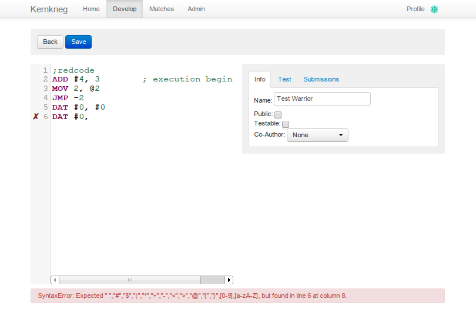
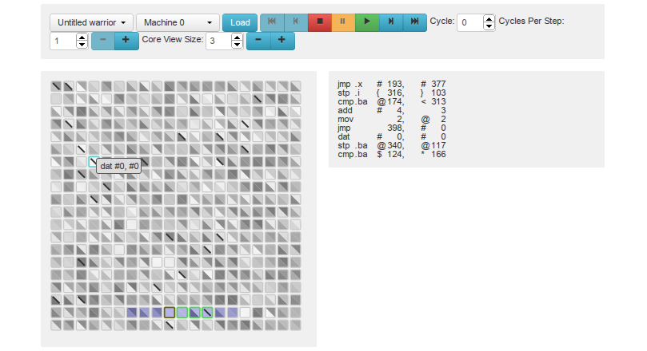

kernkrieg
=========

A Core Wars contest and development environment with visual debugger, MARS and redcide assember in angularjs, flask and nodejs. Needs redis server to handle process queues which run matches in the background.

Screenshots
-----------

### Redcode editor

### Redcode debugger

Installation
------------

1. Clone this repo
2. Install [Bower](http://bower.io) if you don't already have it (`npm install -g bower`, assuming you have npm installed)
3. Run `bootstrap.sh` in the root directory to download both python and JS dependencies
4. Install redis

Running the app
---------------
To spin up a local copy of the web app, run `./kernkreig` from the root directory.

Visit `0.0.0.0:1234/reset_db` to set up the database.

After that, go to `0.0.0.0:1234` to log in. The default username/password is `admin`/`admin`. The first thing you'll want to do is go to the admin panel and create a new machine and queue. Creating a new machine will create a new test queue for you; if you want to run matches, you'll want to create a queue for that as well (a queue of type '0' is a test queue. '1' is a free-for-all match queue, and '2' is a queue for ranked matches, using the TrueSkill algorithm.)

In order to actually run tests or matches, you'll need both redis to be running and a worker script. To start up a worker script, run `./kkworker matches` or `./kkworker tests` for real matches or tests, respectively.

